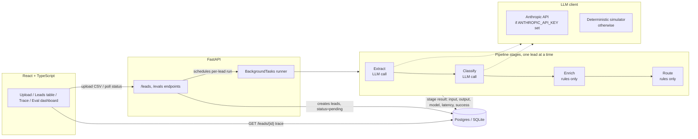

# Signal

**AI-powered lead enrichment & routing pipeline.** Upload a CSV of raw leads, watch each one move through a live-updating `extract → classify → enrich → route` pipeline, inspect the full LLM trace for any lead, and see prompt-version-over-version classification accuracy on a hand-labeled eval set.

[](https://github.com/jamesmartin6/signal/actions/workflows/ci.yml)
[](LICENSE)

---

## Why this exists

Most "I called an LLM API" projects stop at the API call. Signal is built around the parts that actually make an LLM pipeline production-shaped:

- **Schema-constrained output with a real retry path.** Every LLM call targets a Pydantic schema; a validation failure retries once with the error fed back to the model, and a second failure fails the lead loudly with the bad output preserved — never a silent crash or a shrugged-off `None`.
- **Full observability.** Every pipeline stage — for every lead — persists its exact input, validated output, model, and latency. `GET /leads/{id}` returns the complete trace, not just a final status.
- **A real eval suite, not a vibe check.** 22 hand-labeled classification cases, including deliberately ambiguous edge cases. Two prompt versions are scored against the same set, and the improvement is a real, reproducible number (see below) — not an anecdote.
- **A state machine with per-stage failure isolation.** One bad lead in a batch of 500 fails on its own; it doesn't take the batch down.

## The eval result

The whole point of `classify_v1` → `classify_v2` is a genuine before/after, not a cosmetic diff. `classify_v1`'s prompt says "senior/exec-level roles are decision makers," which conflates *seniority* with *role function* — a **Principal Software Engineer** is senior by title but is an individual contributor with no purchasing authority. `classify_v2` fixes this by checking role function before seniority.

```
classify_v1: 19/22 passed (86.4%)
classify_v2: 22/22 passed (100.0%)
```

`classify_v1`'s three failures were all the same root cause — Principal/Staff/Distinguished Engineer, all senior-sounding individual-contributor titles, misclassified as `decision_maker`. `classify_v2` fixed all three by checking role function before seniority, with no regressions on the other 19 cases.

> These numbers come from the built-in deterministic simulator (see [LLM client design](#llm-client-real-anthropic-or-deterministic-simulator) below) since this environment has no `ANTHROPIC_API_KEY` configured. Re-run `python -m app.evals.run_eval --prompt-version classify_v1` / `classify_v2` after adding a real key to get the real-model numbers — the mechanism (and the underlying prompt bug/fix) is identical either way.

Reproduce it yourself:

```bash
cd backend
python -m app.evals.run_eval --prompt-version classify_v1
python -m app.evals.run_eval --prompt-version classify_v2
```

## Architecture



**Data model:** `leads` (status state machine: `pending → extracting → classifying → enriching → routing → done`, or `failed` at any stage) · `pipeline_stage_results` (one row per stage per lead — the full trace) · `eval_runs` (one row per eval script run).

## LLM client: real Anthropic or deterministic simulator

There's no LLM API key baked into this repo (there shouldn't be). `app/llm/client.py` defines a narrow `LLMClient` interface — system prompt + user prompt in, text out — with two implementations selected automatically by `get_llm_client()`:

- **`AnthropicLLMClient`** — real calls to the Anthropic API, used whenever `ANTHROPIC_API_KEY` is set.
- **`SimulatedLLMClient`** — a deterministic, rule-based stand-in with the *exact same interface*, used otherwise. It reads the same rendered prompts a real model would (it finds the bio inside the extract prompt's `Bio: """ ... """` block, and the upstream `ExtractedProfile` JSON embedded in the classify prompt) and mirrors the same `classify_v1`/`classify_v2` logic difference described above.

This means the whole pipeline, the frontend, and the eval suite work end to end with **zero configuration** — clone, install, run, upload a CSV, watch it flow through the pipeline — while still being a real, swappable integration for anyone who adds a key. Every pipeline stage is written once against `LLMClient` and works unmodified against either implementation.

## Quickstart

### Option A — Docker Compose (Postgres + backend + frontend)

```bash
docker compose up --build
```

- Frontend: http://localhost:5173
- Backend: http://localhost:8000 (`/health`, `/docs` for interactive API docs)
- Postgres: `localhost:5432` (user/pass/db: `signal`)

Add a real key by exporting `ANTHROPIC_API_KEY` before running `docker compose up` if you want real LLM calls instead of the simulator.

> Note: this repo was built and tested in a sandbox without Docker available, so the compose stack itself wasn't run end-to-end in that environment — the backend and frontend were fully verified independently (see `progress.md` for the exact verification log). The Dockerfiles and compose file follow standard, well-trodden patterns; if something's off, `docker compose logs` is the place to start.

### Option B — No Docker (SQLite, zero config)

```bash
# backend
cd backend
python -m venv .venv
.venv/bin/pip install -e ".[dev]"       # Windows: .venv\Scripts\pip install -e ".[dev]"
.venv/bin/alembic upgrade head          # Windows: .venv\Scripts\alembic upgrade head
.venv/bin/uvicorn app.main:app --reload # Windows: .venv\Scripts\uvicorn app.main:app --reload

# frontend, in a second terminal
cd frontend
npm install
npm run dev
```

Open http://localhost:5173, upload a CSV with columns `name`, `company`, `bio_or_linkedin_url`, and watch it flow through the pipeline.

### Running the eval suite

```bash
cd backend
python -m app.evals.run_eval --prompt-version classify_v1
python -m app.evals.run_eval --prompt-version classify_v2
```

Each run prints a pass/fail breakdown and writes a row to `eval_runs`, which `GET /evals` (and the frontend's Eval dashboard) picks up.

### Running the tests

56 backend tests (unit + integration, all deterministic — mocked LLM client for retry-path tests, simulated LLM client for full-pipeline/eval tests), plus 1 opt-in real-API test skipped by default.

```bash
cd backend
pytest                              # fast, deterministic, mocked/simulated LLM — this is what CI runs
RUN_REAL_LLM_TESTS=1 ANTHROPIC_API_KEY=sk-... pytest tests/test_extract_real_api.py  # optional, hits the real API
```

```bash
cd frontend
npm run build   # type-checks + builds
npm run lint
```

## API

| Method | Path | Description |
|---|---|---|
| `GET` | `/health` | Liveness check |
| `POST` | `/leads/upload` | Upload a CSV (`multipart/form-data`, field name `file`); creates one lead per valid row and schedules the pipeline in the background |
| `GET` | `/leads` | Paginated list of leads with current status (`?limit=&offset=`) |
| `GET` | `/leads/{id}` | Single lead, including its full `pipeline_stage_results` trace |
| `GET` | `/evals` | All recorded eval runs (prompt version, pass rate, case counts) |

Interactive docs (Swagger UI) are served at `/docs` whenever the backend is running.

## Repo structure

```
signal/
├── docker-compose.yml
├── backend/
│   ├── app/
│   │   ├── main.py                  # FastAPI app, CORS, lifespan (schema bootstrap, seq counter reseed)
│   │   ├── config.py                # env-driven settings
│   │   ├── ingest.py                # CSV parsing (file-level errors vs. per-row skips)
│   │   ├── logging_config.py        # structured JSON logs for every pipeline stage call
│   │   ├── db/                      # SQLAlchemy models + session
│   │   ├── api/                     # leads.py, evals.py, schemas.py
│   │   ├── llm/
│   │   │   ├── client.py            # LLMClient interface, AnthropicLLMClient, generate_structured() retry logic
│   │   │   ├── simulator.py         # SimulatedLLMClient (extraction heuristics)
│   │   │   ├── classify_simulator.py# mirrors classify_v1/v2 for the simulated path
│   │   │   └── keywords.py          # word-boundary-safe keyword matching
│   │   ├── pipeline/
│   │   │   ├── extract.py / classify.py / enrich.py / route.py  # one stage each
│   │   │   ├── runner.py            # run_pipeline(): the state machine + failure isolation
│   │   │   ├── schemas.py           # ExtractedProfile, ClassificationResult, EnrichmentResult, RouteResult
│   │   │   └── prompts/             # extract_v1, classify_v1, classify_v2
│   │   └── evals/
│   │       ├── cases/classify_cases.json
│   │       └── run_eval.py
│   ├── alembic/                     # migrations
│   └── tests/
└── frontend/
    └── src/
        ├── api/client.ts            # typed fetch wrapper
        ├── types/lead.ts            # mirrors backend Pydantic schemas
        ├── hooks/useLeadsPolling.ts
        └── components/              # UploadForm, LeadsTable, LeadTrace, EvalDashboard
```

## Design notes / what to actually look at

If you're reviewing this as a work sample, the highest-signal files are:

- `backend/app/llm/client.py` — the retry-on-schema-validation-failure pattern (`generate_structured`)
- `backend/app/pipeline/prompts/classify_v1.py` + `classify_v2.py` — the actual prompt diff behind the eval improvement above
- `backend/app/pipeline/runner.py` — the state machine and per-stage failure isolation
- `backend/app/evals/run_eval.py` + `backend/app/evals/cases/classify_cases.json` — the eval harness and hand-labeled cases
- `backend/tests/test_pipeline_e2e.py` — a full, non-mocked pipeline run

## License

MIT — see [LICENSE](LICENSE).
